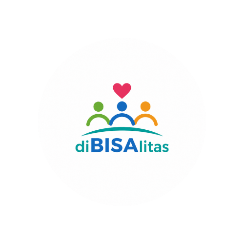

# 🌟 diBISAlitas - Platform Aksesibilitas & Inklusivitas Terintegrasi Berbasis AI

<div align="center">



**Empowering Accessibility, Bridging Communication with On-Device Artificial Intelligence**

[](https://nextjs.org/)
[](https://flutter.dev/)
[](https://www.typescriptlang.org/)
[](https://ultralytics.com)
[](https://onnxruntime.ai/)
[](https://firebase.google.com/)

</div>

---

## 📌 Tentang diBISAlitas

**diBISAlitas** adalah ekosistem aplikasi inklusif multi-platform (Web & Mobile) yang dirancang untuk mendukung kemandirian, komunikasi, dan keamanan teman tuli, teman netra, serta masyarakat umum. Dengan mengintegrasikan kecerdasan buatan (*On-Device AI Inference*), diBISAlitas menghadirkan solusi aksesibilitas yang cepat, privat, dan tanpa ketergantungan latensi server.

---

## 🚀 Fitur Utama

### 1. 🤟 BiPINTAR (Sign Language Learning & Recognition)
- **Deteksi Isyarat Real-Time**: Mengenali alfabet BISINDO dan Isyarat Hijaiyah langsung melalui kamera browser/HP menggunakan YOLOv8 (ONNX WebAssembly & TFLite).
- **Kamus & Visualisasi Interaktif**: Katalog abjad lengkap disertai animasi panduan dan pengucapan suara.
- **Kuis Isyarat AI**: Uji pemahaman isyarat dengan penilaian dinamis langsung dari gestur pengguna.
- **Statistik & Peringkat (Leaderboard)**: Gamifikasi pembelajaran dengan sistem poin dan riwayat kemajuan.

### 2. 🚶 BiJALAN (Smart Navigation & Obstacle Detection)
- **Deteksi Rintangan Dalam Ruangan**: AI pendeteksi halangan indoor (kursi, tangga, pintu, dll.) secara *real-time*.
- **Panduan Suara Terarah (Voice Guidance)**: Integrasi TalkBack dan Text-to-Speech (TTS) untuk memberi instruksi jarak dan arah halangan secara otomatis.
- **Pelaporan Rintangan**: Pengguna dapat menandai dan melaporkan rintangan fasilitas umum untuk dipetakan.

### 3. 🛡️ BiSAFE (Emergency & Safety System)
- **Panic Button & Shake-to-Alert**: Pengiriman sinyal bahaya cepat dengan guncangan perangkat (*Shake Gesture*).
- **Geolokasi Presisi**: Pelacakan koordinat darurat langsung tersambung ke kontak darurat terdaftar dan layanan terkait.

### 4. 📖 BiBACA (Assistive OCR & Reading)
- **Ekstraksi Teks Visual**: Membaca dokumen, buku, atau tanda visual menggunakan Optical Character Recognition (OCR).
- **Audio Reader**: Membacakan teks hasil pemindaian dengan suara natural untuk teman netra.

### 5. 💬 BiSAPA (Inclusive Communication Bridge)
- **Dua Arah (STT & TTS)**: Mengubah ucapan suara menjadi teks instan untuk teman tuli, dan mengetik teks untuk diubah menjadi suara natural bagi lawan bicara.

### 6. 🗺️ Peta Aksesibilitas & Komunitas
- **Peta Fasilitas Ramah Disabilitas**: Menemukan lokasi fasilitas publik yang ramah disabilitas.
- **Forum & Diskusi Komunitas**: Ruang interaksi, berbagi informasi, dan edukasi seputar inklusivitas.

### 7. 📊 Portal Admin & Manajemen
- **Analitik Hotspot Rintangan**: Dashboard pemantauan laporan rintangan publik.
- **Manajemen Pengumuman & Pengguna**: Pengelolaan data komunitas dan keamanan sistem.

---

## 🏗️ Arsitektur Teknologi

```
diBISAlitas Ecosystem
├── 🌐 Web Application (Next.js 15, React 19, TypeScript, TailwindCSS)
│   ├── On-Device Inference: ONNX Runtime Web (WASM / SIMD / WebGL)
│   ├── PWA & Offline Support: Serwist Service Worker
│   └── Backend Services: Firebase Auth, Firestore, Cloud Storage
│
├── 📱 Mobile Application (Flutter 3.x, Dart)
│   ├── On-Device Inference: TFLite (TensorFlow Lite Native)
│   ├── Hardware Integration: Camera, Sensors (Accelerometer for Shake), Geolocation
│   └── Accessibility Services: Screen Reader TalkBack & Custom Speech Engines
│
└── 🧠 Machine Learning Pipelines
    ├── Model BISINDO (YOLOv8 Nano Optimized)
    ├── Model Hijaiyah (YOLOv8 Nano Optimized)
    └── Model Indoor Obstacle Detection
```

---

## ⚙️ Panduan Menjalankan Proyek

### 🌐 1. Web Application

```bash
# Masuk ke direktori web
cd web

# Instal dependensi
npm install

# Jalankan development server
npm run dev
```
Akses aplikasi melalui browser di `http://localhost:3000`.

### 📱 2. Mobile Application (Flutter)

```bash
# Masuk ke direktori mobile
cd mobile

# Unduh paket dependensi Flutter
flutter pub get

# Jalankan pada emulator atau perangkat fisik
flutter run
```

---

## 🔒 Privasi & Aksesibilitas
- **Privasi Terjaga**: Pemrosesan video kamera untuk deteksi isyarat dan rintangan berjalan sepenuhnya di sisi klien (*Client-side / On-Device*), frame gambar tidak dikirim atau disimpan di server eksternal.
- **Standar Aksesibilitas WCAG**: Kontras warna optimal, kompatibilitas navigasi suara, serta tata letak responsif.

---

<div align="center">
  <b>diBISAlitas - Mewujudkan Kesetaraan Akses dan Komunikasi Inklusif</b>
</div>
